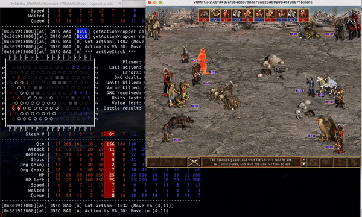
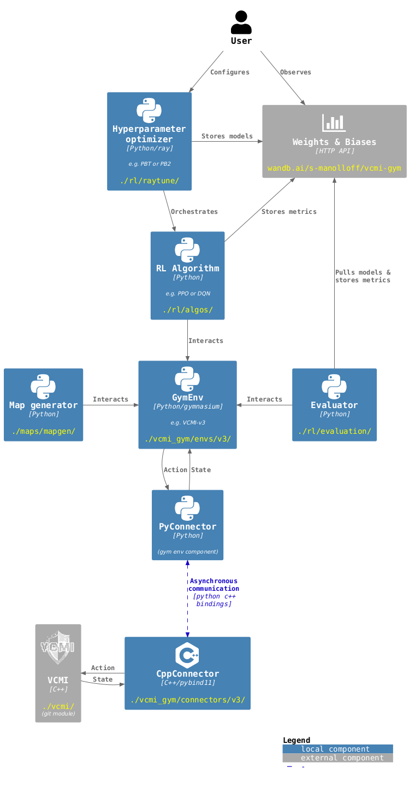

# VCMI Gym

`vcmi-gym` is a project which aims to create a gym-compatible reinforcement
learning environment for VCMI (the open-source recreation of
Heroes of Might & Magic III game) along with implementations of RL algorithms
and other supplementary code (orchestration, hyperparameter tuning, observability)
needed to produce VCMI combat AI models.

## Project state

The project is in a late stage of active development. The gym environment
is stable and AIs can be successfully trained, although the optimal NN
architecture and RL algorithm for the task are yet to be discovered (this
process which involves a *lot* of experimentation).

An RL model is [currently in training](https://wandb.ai/s-manolloff/vcmi-gym),
but the progress is slow due to the resource-constrained harware environment I
am using.

### Future plans

And as soon the RL model is able to surpass VCMI's default "BattleAI" bot
performance (even by a small fraction), the project will advance to its final
stage, involving collaboration with the VCMI devs to come up with
a strategy for rolling out pre-trained AI models (e.g. as a VCMI mod).

## Project architecture

A high-level overview of the `vcmi-gym` project is given in the below diagram:

The W&B external component is optional. VCMI (the game itself) is required --
it is a fork of VCMI with some modifications for RL training purposes and is
managed in a [separate repo](https://github.com/smanolloff/vcmi), tracked as a
[git submodule](https://git-scm.com/book/en/v2/Git-Tools-Submodules) located
at `./vcmi`.

## Getting started

### Installation

A step-by-step setup guide can be found below:
* [MacOS](./doc/setup_macos.md)
* [Linux](./doc/setup_ubuntu.md)
* No setup guide for Windows :(. Contributions in this regard are welcome.

### Environment documentation

Please refer to [this document](./doc/env_info.md) for more information about
the RL environment.

### RL training setup

Please refer to [this document](./doc/rl_training.md) for information about 
the RL training setup and tools used in this project.

## Contributing

Fellow HOMM3 AI enthusiasts are more than welcome to help with this project.
There is a lot of headroom for improvement, be it in the form of NN
architectures, RL algorithm implementations, hyperparameter search, reward
shaping, etc.

### Submitting an issue

Please check for existing issues and verify that your issue is not already
submitted. If it is, it's highly recommended to add to that issue with your
reports.

When submitting a new issue, please be as detailed as possible - OS and Python
versions, what did you do, what did you expect to happen, and what actually
happened.

### Submitting a Pull Request

1. Find an existing issue to work on or follow "Submitting an issue" to first
  create one that you're also going to fix.
  Make sure to notify that you're working on a fix for the issue you picked.
1. Branch out from latest `main` and organize your code changes there.
1. Commit, push to your branch and submit a PR to `main`.

### RL training contributions

If you have good spare hardware, please
<a href="mailto:smanolloff@gmail.com">reach out</a> so we can work together
on putting it to good use: e.g. for training new models (GPU-bound task),
evaluating existing models (CPU-bound task), or creating and rebalancing
new training maps (CPU and HDD-bound task).
