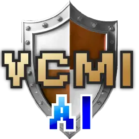

  <h3>
    Follow the journey:
     
    <a href="https://smanolloff.github.io/projects/vcmi-gym/">smanolloff.github.io</a>
  </h3>

---

# VCMI Gym

`vcmi-gym` is a project which aims to create a gym-compatible reinforcement
learning environment for VCMI (the open-source recreation of
Heroes of Might & Magic III game) along with implementations of RL algorithms
and other supplementary code (orchestration, hyperparameter tuning, observability)
needed to produce VCMI combat AI models.

### Codename `MMAI`

`MMAI` is the name of VCMI's AI which uses the models trained in vcmi-gym.

It was introduced in
[VCMI v1.7.0](https://github.com/vcmi/vcmi/blob/68a1a900ae50c4c2dd92234a7e64b3fd162d3217/ChangeLog.md)
as an experimental ML-powered AI and is now available in the VCMI Settings:

<kbd>

</kbd>

Feel free to try it out!
[Install VCMI](https://github.com/vcmi/vcmi?tab=readme-ov-file#installation-guides),
choose "MMAI" and press Play ;)

## Project state

`vcmi-gym` is in a state of active development. Updates to the
gym environment, NN architecture and RL algorithms are made frequently.
Although the first models are already out, training new models is an
[ongoing effort](https://smanolloff.github.io/projects/vcmi-gym/).

Documentation is outdated :( There is too much going on at the moment and I
really can't keep up. I will eventually update it to smoothen the onboarding
process for AI enthusiasts and contributors. Until then, you can read my
[vcmi-gym journal](https://smanolloff.github.io/projects/vcmi-gym/) for an
up-to-date (albeit less-technical) overview of the current project state.

## Project architecture

A high-level overview of the `vcmi-gym` project is given in the below diagram:

The W&B external component is optional. VCMI (the game itself) is required
(specifically, a VCMI [fork](https://github.com/smanolloff/vcmi/tree/mmai-ml)
with modifications for RL training purposes which are not part of the official
game yet).

## Getting started

> [!WARNING]
> This documentation is outdated and the installation instructions will
> not work :(.
>
> Updates will follow as soon as I can spare the time. Until then, you can read my
> [vcmi-gym journal](https://smanolloff.github.io/projects/vcmi-gym/) for a
> recently updated (albeit less-technical) overview of the current project state.

### Installation

A step-by-step setup guide can be found below:
* [MacOS](./doc/setup_macos.md)
* [Linux](./doc/setup_ubuntu.md)
* No setup guide for Windows :(. Contributions in this regard are welcome.

### Environment documentation

Please refer to [this document](./doc/env_info.md) for more information about
the RL environment.

### RL training setup

Please refer to [this document](./doc/rl_training.md) for information about 
the RL training setup and tools used in this project.

### Connector docs

Please refer to [this document](./doc/rl_training.md) for information about 
the Connector component.

## Contributing

Fellow HOMM3 AI enthusiasts are more than welcome to help with this project.
There is a lot of headroom for improvement, be it in the form of NN
architectures, RL algorithm implementations, hyperparameter search, reward
shaping, etc. The preferred approach is to submit a Pull request, but if you
have stumbled upon a bug which you can't fix yourself, submitting an issue can
help me (and others) fix it. You can also help with the ongoing AI training
process by "plugging in" your own piece of hardware into the mix. 

### Submitting an issue

Please check for existing issues and verify that your issue is not already
submitted. If it is, it's highly recommended to add to that issue with your
reports.

When submitting a new issue, please be as detailed as possible - OS and Python
versions, what did you do, what did you expect to happen, and what actually
happened.

### Submitting a Pull Request

1. Find an existing issue to work on or follow "Submitting an issue" to first
  create one that you're also going to fix.
  Make sure to notify that you're working on a fix for the issue you picked.
1. Branch out from latest `main` and organize your code changes there.
1. Commit, push to your branch and submit a PR to `main`.

### Contributing with RL training

If you have spare hardware and would like to help with this project, please
<a href="mailto:smanolloff@gmail.com">reach out</a> to me - together, we can
ponder on putting it to good use: e.g. for training new models (GPU-bound
task), evaluating existing models (CPU-bound task), or creating and rebalancing
new training maps (CPU and HDD-bound task).
