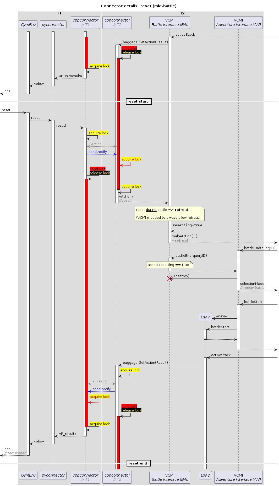

# Connector documentation

Here you will find general information about the VCMI connector, why it is
needed and how it works.

## What is it?

The connector is the "man-in-the-middle" for all communication between
`VcmiGym` (Python gym environment) and VCMI (C++ library):

Internally, the Connector is composed of two parts: 
* PyConnector
* CppConnector

Together, they form the "link" between the gym env and VCMI.

## Why is it needed?

If we take VcmiGym's point of view, communication with VCMI is as simple as
calling `vcmi.get_state(action)` to obtain the new environment state:

Doing the same with VCMI's point of view, communication with VcmiGym
(the "AI") is as simple as calling `ai.getAction(state)` to obtain next action:

The problem is: both components assume the role of the *caller* in this
state-action exchange and that simply can't happen in practice without some
kind of a buffer in between. That "buffer" is the Connector and here's how it
works:

Although more stuff is happening under the hood, in a nutshell, two different
threads are synchronized with the help of locks and condvars. Here's the same
call to `step()` with some implementation details:

There's several more of those diagrams. They really helped me during the
connector development phase, so others (and future me) might find them useful
as well:

#### Connector details - VCMI init:

#### Connector details - render:

#### Connector details - reset (after battle end):

#### Connector details - reset (mid-battle):

