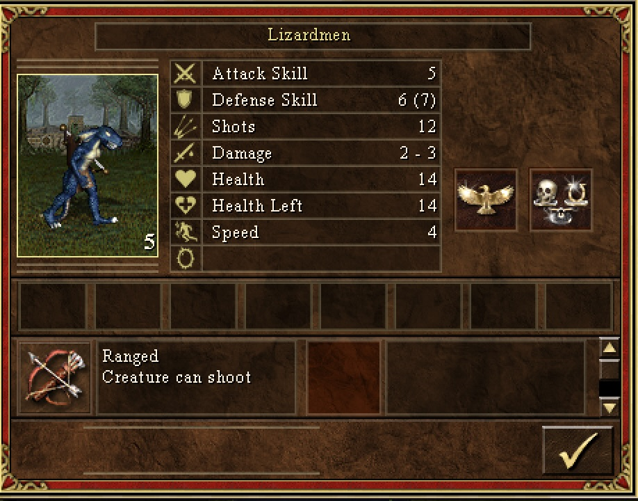
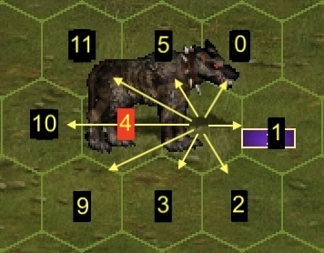

# Environment documentation


Here you will find documentation for the VCMI environment.

> [!NOTE]
> Note that this document is about the `VCMI-v3` gym environment, which (as of
> Aug 2024) is the newest available version. Other environment versions may use
> different actions, observations and rewards, so please refer to the source
> code if you need more information about them.

`vcmi-gym` implements the Gym API spec, please refer to the
[Gymnasium](https://gymnasium.farama.org/) documentation for reference.

## Starting

VCMI is written in C++ and has an ML extension which must be compiled as a
dynamic library `libmlclient` (compilation instructions
[here](https://github.com/smanolloff/vcmi)). This library is linked to the main python
process at runtime as part of the gym environment's boot process.

Starting the RL environment automatically starts VCMI in a separate thread.
Communication between the two threads is made possible via the `connector`
component (for details on how it works, [Connector](TODO:link) documentation will
be published soon).

Starting the environment is as simple as:

```python
import gymnasium as gym
import vcmi_gym

env = gym.make("VCMI-v3", mapname="gym/A1.vmap")
```

There are more than 30 optional startup arguments which can be used to
customize the environment. Information about them can be found in `VcmiEnv`'s
`__init__` docstring [here](../vcmi_gym/envs/v3/vcmi_env.py).

## <a id="observations"></a> 👁️ Observations

On each timestep, a flat (1-D) [`Box`](https://gymnasium.farama.org/api/spaces/fundamental/#box)
observation space with a total of 12685 floats is returned.

These floats represent the encoded equivalents of various aspects of the
current environment state. Three main encoding types are used in the observation:
* Normalized - input value is normalized between `0` and `1`
* categorical - input value is [one-hot](https://en.wikipedia.org/wiki/One-hot) encoded
* binary - input value is represented as a [binary number](https://en.wikipedia.org/wiki/Binary_number)

Depending on how NULL values are handled, there can be different variations of
those encodings. The below table contains examples which should explain the differences:

<table>
    <thead>
        <tr>
            <th rowspan=2>Encoding</th>
            <th rowspan=2>NULL handling</th>
            <th rowspan=2>Abbreviation</th>
            <th colspan=2>Example attribute<br><code>vmax=5</code></th>
        </tr>
        <tr>
            <th>Input</th>
            <th>Output</th>
        </tr>
    </thead>
    <tbody>
        <tr>
            <td rowspan=4>Categorical</td>
            <td rowspan=4>Explicit</td>
            <td rowspan=4>CE</td>
            <td><code>v=5</code></td>
            <td><code>[0, 0, 0, 0, 0, 0, 1]</code></td>
        </tr>
        <tr>
            <td><code>v=3</code></td>
            <td><code>[0, 0, 0, 0, 1, 0, 0]</code></td>
        </tr>
        <tr>
            <td><code>v=0</code></td>
            <td><code>[0, 1, 0, 0, 0, 0, 0]</code></td>
        </tr>
        <tr>
            <td>null</td>
            <td><code>[1, 0, 0, 0, 0, 0, 0]</code></td>
        </tr>
        <tr>
            <td rowspan=4>Categorical</td>
            <td rowspan=4>Strict</td>
            <td rowspan=4>CS</td>
            <td><code>v=5</code></td>
            <td><code>[0, 0, 0, 0, 0, 1]</code></td>
        </tr>
        <tr>
            <td><code>v=3</code></td>
            <td><code>[0, 0, 0, 1, 0, 0]</code></td>
        </tr>
        <tr>
            <td><code>v=0</code></td>
            <td><code>[1, 0, 0, 0, 0, 0]</code></td>
        </tr>
        <tr>
            <td>null</td>
            <td>error</td>
        </tr>
        <tr>
            <td rowspan=4>Binary</td>
            <td rowspan=4>Explicit</td>
            <td rowspan=4>BE</td>
            <td><code>v=5</code></td>
            <td><code>[0, 1, 0, 1]</code></td>
        </tr>
        <tr>
            <td><code>v=3</code></td>
            <td><code>[0, 0, 1, 1]</code></td>
        </tr>
        <tr>
            <td><code>v=0</code></td>
            <td><code>[0, 0, 0, 0]</code></td>
        </tr>
        <tr>
            <td>null</td>
            <td><code>[1, 0, 0, 0]</code></td>
        </tr>
        <tr>
            <td rowspan=4>Binary</td>
            <td rowspan=4>Zero</td>
            <td rowspan=4>BZ</td>
            <td><code>v=5</code></td>
            <td><code>[1, 0, 1]</code></td>
        </tr>
        <tr>
            <td><code>v=3</code></td>
            <td><code>[0, 1, 1]</code></td>
        </tr>
        <tr>
            <td><code>v=0</code></td>
            <td><code>[0, 0, 0]</code></td>
        </tr>
        <tr>
            <td>null</td>
            <td><code>[0, 0, 0]</code></td>
        </tr>
        <tr>
            <td rowspan=4>Binary</td>
            <td rowspan=4>Strict</td>
            <td rowspan=4>BS</td>
            <td><code>v=5</code></td>
            <td><code>[1, 0, 1]</code></td>
        </tr>
        <tr>
            <td><code>v=3</code></td>
            <td><code>[0, 1, 1]</code></td>
        </tr>
        <tr>
            <td><code>v=0</code></td>
            <td><code>[0, 0, 0]</code></td>
        </tr>
        <tr>
            <td>null</td>
            <td>error</td>
        </tr>
        <tr>
            <td rowspan=4>Normalized</td>
            <td rowspan=4>Explicit</td>
            <td rowspan=4>NE</td>
            <td><code>v=5</code></td>
            <td><code>[0, 1]</code></td>
        </tr>
        <tr>
            <td><code>v=3</code></td>
            <td><code>[0, 0.6]</code></td>
        </tr>
        <tr>
            <td><code>v=0</code></td>
            <td><code>[0, 0]</code></td>
        </tr>
        <tr>
            <td>null</td>
            <td><code>[1, 0]</code></td>
        </tr>
        <tr>
            <td rowspan=4>Normalized</td>
            <td rowspan=4>Strict</td>
            <td rowspan=4>NS</td>
            <td><code>v=5</code></td>
            <td><code>[1]</code></td>
        </tr>
        <tr>
            <td><code>v=3</code></td>
            <td><code>[0.6]</code></td>
        </tr>
        <tr>
            <td><code>v=0</code></td>
            <td><code>[0]</code></td>
        </tr>
        <tr>
            <td>null</td>
            <td>error</td>
        </tr>
    </tbody>
</table>

All 12685 floats in the observation represent encoded information for a total
of 20 stacks (10 attacker stacks, 10 defender stacks) and 165 hexes
(the number of hexes on the battlefield).


### <a id="stacks"></a> Stacks

The first 1960 floats of the observation provide information about the stacks
on the battlefield and are distributed as follows:

| Stack ID | Index        | Description |
| -------- | ------------ | ----------- |
| 1        | `0` ... `97`      | Red army slot #1 |
| 2        | `98` ... `195`    | Red army slot #2 |
| 3        | `196` ... `293`   | Red army slot #3 |
| 4        | `294` ... `391`   | Red army slot #4 |
| 5        | `392` ... `489`   | Red army slot #5 |
| 6        | `490` ... `587`   | Red army slot #6 |
| 7        | `588` ... `685`   | Red army slot #7 |
| 8        | `686` ... `783`   | Red army extra slot #1 \* |
| 9        | `784` ... `881`   | Red army extra slot #2 \* |
| 10       | `882` ... `979`   | Red army extra slot #3 \* |
| 11       | `980` ... `1077`  | Blue army slot #1 |
| 12       | `1078` ... `1175` | Blue army slot #2 |
| 13       | `1176` ... `1273` | Blue army slot #3 |
| 14       | `1274` ... `1371` | Blue army slot #4 |
| 15       | `1372` ... `1469` | Blue army slot #5 |
| 16       | `1470` ... `1567` | Blue army slot #6 |
| 17       | `1568` ... `1665` | Blue army slot #7 |
| 18       | `1666` ... `1763` | Blue army extra slot #1 \* |
| 19       | `1764` ... `1861` | Blue army extra slot #2 \* |
| 20       | `1862` ... `1959` | Blue army extra slot #3 \* |

\* An "extra" slot is used for summoned creatures and war machines. If there
are more than 10 alive stacks in the hero's army, some of them will remain
"hidden" from the agent.

> [!NOTE]
> The terms "attacker", "left" and "red" are used interchangeably here. The
> same applies for "defender", "right" and "blue". This is because in VCMI, the
> attacking army is always on the left side and AI training maps are designed
> such that the red player always attacks the blue player.

Each stack is represented by a total of 98 floats which represent the
creature's attirbutes, similar to what the player would see when right-clicking
on the creature: owner, quantity, creature type, attack, defence, etc.:



| Stack Attribute       | Index          | Encoding  | Description |
| --------------------- | -------------- | --------- | ----------- |
| ID                    | `0` ... `20`   | CE        | Stack number |
| Y_COORD               | `21` ... `32`  | CE        | Y coordinate of stack's front hex |
| X_COORD               | `33` ... `48`  | CE        | X coordinate of stack's front hex |
| SIDE                  | `49` ... `51`  | CE        | Side in battle (attacker/defender) |
| QUANTITY              | `52` ... `53`  | NE        | Stack quantity |
| ATTACK                | `54` ... `55`  | NE        | Attack |
| DEFENSE               | `56` ... `57`  | NE        | Defense |
| SHOTS                 | `58` ... `59`  | NE        | Shots remaining |
| DMG_MIN               | `60` ... `61`  | NE        | Dmg (min) |
| DMG_MAX               | `62` ... `63`  | NE        | Dmg (max) |
| HP                    | `64` ... `65`  | NE        | Hit points |
| HP_LEFT               | `66` ... `67`  | NE        | Hit points left |
| SPEED                 | `68` ... `69`  | NE        | Speed |
| WAITED                | `70` ... `71`  | NE        | Waited this turn? |
| QUEUE_POS             | `72` ... `73`  | NE        | Turn order queue position |
| RETALIATIONS_LEFT     | `74` ... `75`  | NE        | Retaliations left |
| IS_WIDE               | `76` ... `77`  | NE        | Is it a two-hex stack? |
| AI_VALUE              | `78` ... `79`  | NE        | [AI value](https://heroes.thelazy.net/index.php/AI_value) |
| MORALE                | `80` ... `81`  | NE        | Morale |
| LUCK                  | `82` ... `83`  | NE        | Luck |
| FLYING                | `84` ... `85`  | NE        | Can fly? |
| BLIND_LIKE_ATTACK     | `86` ... `87`  | NE        | Chance to blind/paralyze/petrify |
| ADDITIONAL_ATTACK     | `88` ... `89`  | NE        | Attacks twice? |
| NO_MELEE_PENALTY      | `90` ... `91`  | NE        | Has no melee penalty? |
| TWO_HEX_ATTACK_BREATH | `92` ... `93`  | NE        | Has dragon breath? |
| NON_LIVING            | `94` ... `95`  | NE        | Is undead or otherwise non-living? |
| BLOCKS_RETALIATION    | `96` ... `97`  | NE        | Has no enemy retaliation? |

#### <a id="hexes"></a> Hexes

The remaining 10725 floats of the observation carry information about the 165
battlefield hexes:


Each hex is represented by a total of 65 floats with information about several
key characteristics of that hex:

| Hex Attribute | Index          | Encoding  | Description |
| ------------- | -------------- | --------- | ----------- |
| Y_COORD       | `0` ... `10`   | CS        | Y coordinate of this hex |
| X_COORD       | `11` ... `25`  | CS        | X coordinate of this hex |
| STATE_MASK    | `26` ... `29`  | BS        | Hex state flags \* |
| ACTION_MASK   | `30` ... `43`  | BZ        | Hex action flags for the currently active stack \*\* |
| STACK_ID      | `44` ... `63`  | CE        | Stack ID (see [Stacks](#stacks)) |

\* The hex *state flags* are used to describe a (combination of) hex properties:

| State flag   | Explanation |
| ------------ | ----------- |
| `PASSABLE`   | empty/mine/firewall/gate(open)/gate(closed,defender) |
| `STOPPING`   | moat/quicksand |
| `DAMAGING_L` | moat/mine/firewall that would damage left (i.e. attacker) stacks |
| `DAMAGING_R` | moat/mine/firewall that would damage right (i.e. defender) stacks |

\*\* These hex *action flags* tell us which actions can the currently
active stack perform on that specific hex (see [Action space](#actions)).

The below example shows illustrates to extract information from the observation
via the `.decode()` convenience method:

```python
import gymnasium as gym
import vcmi_gym

env = gym.make("VCMI-v3", mapname="gym/A1.vmap")
observation, _info = env.reset()

""" Raw observation is a numpy array of 12685 floats """
observation
# => array([1., 0., 0., ..., 0., 0., 0.], dtype=float32)

"""
Using env.decode() returns a Battlefield object -- a decoded version of the raw
observation with a minimalistic API allowing to easily explore the information
carried within.
This method is specific to VCMI and is not part of the gym API spec.
"""
bf = env.decode()

""" Get hex 46 (Y=3, X=1). """
h = bf.get_hex(46)  # same as bf.get_hex(3, 1)

""" Print hex data in a human-friendly format. """
h.dump()
# Y_COORD     | 3
# X_COORD     | 1
# STATE_MASK  | PASSABLE
# ACTION_MASK | MOVE

""" Get stack 4. """
s = bf.get_stack(4)

""" Print stack data in a human-friendly format. """
s.dump()
# ID                    | 4
# Y_COORD               | 5
# X_COORD               | 0
# SIDE                  | LEFT
# QUANTITY              | 1
# ATTACK                | 2
# DEFENSE               | 2
# SHOTS                 | 0
# DMG_MIN               | 1
# DMG_MAX               | 1
# HP                    | 1
# ...
```

## <a id="actions"></a> 🕹️ Actions

vcmi-gym uses a
[`Discrete`](https://gymnasium.farama.org/api/spaces/fundamental/#discrete)
action space with a total of 2312 actions which is better thought of
`2` non-hex action + `2310` hex actions.

The non-hex actions are `RETREAT` (=`0`) and `WAIT` (=`1`). The remaining
values are used for the 14 actions on each hex (there are 165 hexes on the
battlefield => `165 * 14 = 2310` hex actions).

For a given Hex (0..164), the action value is: `hex_id * 14 + (1 + action_index)`:

|Action index|Description|
|------|-----------|
|0..11|Move to hex and attack at direction 0..11\*|
|12|Move to hex|
|13|Shoot at hex|

e.g. Moving to hex #2 (X=2, Y=0) corresponds to action `41`.

\* The 12 attack directions are as follows: 0..5 are the hexes that surround
the current unit, while 7..11 are special cases for 2-hex units (3 per side):

<p align="center">



</p>

The below 

```python
import gymnasium as gym
from vcmi_gym import HexAction

env = gym.make("VCMI-v3", mapname="gym/A2.vmap")

""" Decode the observation. """
bf = env.decode()

""" Get the integer representation of 'move to hex 46' """
action = bf.get_hex(46).action(HexAction.MOVE)
# => 658

""" Execute the action. """
env.step(action)
```

### Action masking

The env object exposes the `action_mask()` method which is not part of the
Gym API spec, but is useful for certain Reinforcement Learning scenarios where
invalid actions are masked in order to improve learning performance.

The method returns an `np.array` with 2312 `bool` values, indicating the
validity of the corresponding action (`True` means the action is valid).

## 🍩 <a id="rewards"></a> Rewards

Rewards are returned on each step based on the calculations below.

#### Base reward

The base reward on each step is:

```math
R_{base} = a * (b + c*D_{net} + V_{net}) + σ*d*V_{diff}
```

where:
* **R<sub>base</sub>** is base the reward (optionally modified, see below)
* **D<sub>net</sub>** is the net damage since the last step (**D<sub>dealt</sub> - D<sub>received</sub>**)
* **V<sub>net</sub>** is the net [value](https://heroes.thelazy.net/index.php/AI_value)
of units which died since the last step (**V<sub>killed</sub> - V<sub>lost</sub>**)
* **V<sub>diff</sub>** is the difference in the total army value of the two armies
* **σ** is a term which evaluates to 1 at battle end, 0 otherwise
* **p<sub>1</sub>** is a configurable parameter `step_reward_mult`. It provides
  control over the "weight" of per-step rewards.
  If sparse rewards are desired, this parameter can be set to `0` while the
  the **p<sub>5</sub>** to any non-zero value.
* **p<sub>2</sub>** is a configurable parameter `step_reward_fixed`. A negative
  value can be set for punishing agents who keep running away from the enemy
  troops to avoid damage.
* **p<sub>3</sub>** is a configurable parameter `reward_dmg_factor`. Adjusts
  the role of the damage in the reward calculations. If set to `0`, the reward
  will only depend on the actual units killed, regardless of the damage dealt.
* **p<sub>4</sub>** is a configurable parameter `term_reward_mult`. It provides
  control over the "weight" of the terminal reward.

The resulting value (base reward) is further modified by the following "global"
reward modifiers:

#### Clipped reward

Reward clipping is sometimes advised for more stable learning. It is controlled
by the `reward_clip_tanh_army_frac` parameter:

```math
C = p_5 * V_{mean}
```
```math
R_{clip} = C * \tanh(R_{base} / C)
```
where:
- **C** is an intermediate variable used for clarity
- **R<sub>clip</sub>** is the clipped reward
- **R<sub>base</sub>** is the base reward (see above)
- **V<sub>mean</sub>** is the mean of the total starting values of the two armies
- **p<sub>5</sub>** is a configurable parameter `reward_clip_tanh_army_frac`

A value of `0` will disables clipping (i.e. **R<sub>clip</sub>** = **R<sub>base</sub>**)

#### Scaled reward

Scaling rewards based on the initial starting army values can be achieved via
the `reward_army_value_ref` parameter.

```math
R_{scale} = R_{clip} * p_6 * V_{mean}
```
where:
- **R<sub>sacle</sub>** is the scaled reward
- **R<sub>clip</sub>** is the clipped reward (see above)
- **p<sub>6</sub>** is a configurable parameter `reward_army_value_ref`

The effect of scaled rewards can be explained via an example:

Consider these two VCMI battles:
  * (A) armies with total starting army value = 1K (early game army)
  * (B) armies with total starting army value = 100K (late game army)

Without scaling, the rewards in battle A would be 100 times smaller
than the rewards in battle B.

Specifying an army ref of 10K, A and B's rewards will be multiplied
by 10 and 0.1, effectively negating this discrepancy and ensuring
the RL agent perceives early-game and late-game battles as equally
significant.

## <a id="rendering"></a> 🖼️ Rendering

This gym environment supports only one type of rendering: the ANSI render.

Should be printed in terminals with ANSI color code support,
unicode support and monospaced font (e.g.
[Ubuntu Mono](https://fonts.google.com/specimen/Ubuntu+Mono)):

```python
import gymnasium as gym
import vcmi_gym

env = gym.make("VCMI-v3", mapname="gym/A1.vmap")
print(env.render())
```


> [!TIP]
> If your output looks unaligned, try changing the font of your terminal

## Test Helper

If you want to test the env by playing manually, a convenient helper is provided:

```python
from vcmi_gym import VcmiEnv_v3 as VcmiEnv, HexAction, TestHelper

env = VcmiEnv("gym/A1.vmap");
h = TestHelper(env)

h.move(5, 3)
h.defend()
h.wait()
h.amove(5, 4, HexAction.AMOVE_R)
```
