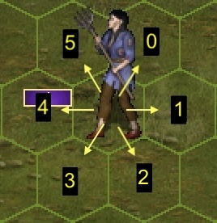

# Environment documentation

> [!WARNING]
> This project is still in active development and its documentation may be
> outdated. It reflects the project's state as of March 2024, but frequent
> code changes make it hard to maintain an up-to-date documentation at
> this stage.

## API

`vcmi-gym` implements the Gym API, please refer to the
[Gymnasium](https://gymnasium.farama.org/) documentation for reference.

## Observation space

vcmi-gym uses a
[`Box`](https://gymnasium.farama.org/api/spaces/fundamental/#box)
observation space with shape `(11, 15, E)`, corresponding to the battlefield's
11x15 hex grid (165 hexes total), where `E` is the hex encoding size (as of
this writing, `E` is 574).

<p align="center"></p>

Every hex is described by `N` attributes, each of which is one-hot encoded as
follows:


| Attribute name                            | Encoding type     | Encoded size |
| ----------------------------------------- | ----------------- | ------------ |
| HEX_Y_COORD                               | CATEGORICAL       | 11           |
| HEX_X_COORD                               | CATEGORICAL       | 15           |
| HEX_STATE \*                              | CATEGORICAL       | 3            |
| HEX_REACHABLE_BY_ACTIVE_STACK             | CATEGORICAL       | 2            |
| HEX_REACHABLE_BY_FRIENDLY_STACK_0         | CATEGORICAL       | 2            |
| HEX_REACHABLE_BY_FRIENDLY_STACK_1         | CATEGORICAL       | 2            |
| HEX_REACHABLE_BY_FRIENDLY_STACK_2         | CATEGORICAL       | 2            |
| HEX_REACHABLE_BY_FRIENDLY_STACK_3         | CATEGORICAL       | 2            |
| HEX_REACHABLE_BY_FRIENDLY_STACK_4         | CATEGORICAL       | 2            |
| HEX_REACHABLE_BY_FRIENDLY_STACK_5         | CATEGORICAL       | 2            |
| HEX_REACHABLE_BY_FRIENDLY_STACK_6         | CATEGORICAL       | 2            |
| HEX_REACHABLE_BY_ENEMY_STACK_0            | CATEGORICAL       | 2            |
| HEX_REACHABLE_BY_ENEMY_STACK_1            | CATEGORICAL       | 2            |
| HEX_REACHABLE_BY_ENEMY_STACK_2            | CATEGORICAL       | 2            |
| HEX_REACHABLE_BY_ENEMY_STACK_3            | CATEGORICAL       | 2            |
| HEX_REACHABLE_BY_ENEMY_STACK_4            | CATEGORICAL       | 2            |
| HEX_REACHABLE_BY_ENEMY_STACK_5            | CATEGORICAL       | 2            |
| HEX_REACHABLE_BY_ENEMY_STACK_6            | CATEGORICAL       | 2            |
| HEX_MELEEABLE_BY_ACTIVE_STACK \*\*        | CATEGORICAL       | 3            |
| HEX_MELEEABLE_BY_FRIENDLY_STACK_0         | CATEGORICAL       | 3            |
| HEX_MELEEABLE_BY_FRIENDLY_STACK_1         | CATEGORICAL       | 3            |
| HEX_MELEEABLE_BY_FRIENDLY_STACK_2         | CATEGORICAL       | 3            |
| HEX_MELEEABLE_BY_FRIENDLY_STACK_3         | CATEGORICAL       | 3            |
| HEX_MELEEABLE_BY_FRIENDLY_STACK_4         | CATEGORICAL       | 3            |
| HEX_MELEEABLE_BY_FRIENDLY_STACK_5         | CATEGORICAL       | 3            |
| HEX_MELEEABLE_BY_FRIENDLY_STACK_6         | CATEGORICAL       | 3            |
| HEX_MELEEABLE_BY_ENEMY_STACK_0            | CATEGORICAL       | 3            |
| HEX_MELEEABLE_BY_ENEMY_STACK_1            | CATEGORICAL       | 3            |
| HEX_MELEEABLE_BY_ENEMY_STACK_2            | CATEGORICAL       | 3            |
| HEX_MELEEABLE_BY_ENEMY_STACK_3            | CATEGORICAL       | 3            |
| HEX_MELEEABLE_BY_ENEMY_STACK_4            | CATEGORICAL       | 3            |
| HEX_MELEEABLE_BY_ENEMY_STACK_5            | CATEGORICAL       | 3            |
| HEX_MELEEABLE_BY_ENEMY_STACK_6            | CATEGORICAL       | 3            |
| HEX_SHOOTABLE_BY_ACTIVE_STACK \*\*        | CATEGORICAL       | 3            |
| HEX_SHOOTABLE_BY_FRIENDLY_STACK_0         | CATEGORICAL       | 3            |
| HEX_SHOOTABLE_BY_FRIENDLY_STACK_1         | CATEGORICAL       | 3            |
| HEX_SHOOTABLE_BY_FRIENDLY_STACK_2         | CATEGORICAL       | 3            |
| HEX_SHOOTABLE_BY_FRIENDLY_STACK_3         | CATEGORICAL       | 3            |
| HEX_SHOOTABLE_BY_FRIENDLY_STACK_4         | CATEGORICAL       | 3            |
| HEX_SHOOTABLE_BY_FRIENDLY_STACK_5         | CATEGORICAL       | 3            |
| HEX_SHOOTABLE_BY_FRIENDLY_STACK_6         | CATEGORICAL       | 3            |
| HEX_SHOOTABLE_BY_ENEMY_STACK_0            | CATEGORICAL       | 3            |
| HEX_SHOOTABLE_BY_ENEMY_STACK_1            | CATEGORICAL       | 3            |
| HEX_SHOOTABLE_BY_ENEMY_STACK_2            | CATEGORICAL       | 3            |
| HEX_SHOOTABLE_BY_ENEMY_STACK_3            | CATEGORICAL       | 3            |
| HEX_SHOOTABLE_BY_ENEMY_STACK_4            | CATEGORICAL       | 3            |
| HEX_SHOOTABLE_BY_ENEMY_STACK_5            | CATEGORICAL       | 3            |
| HEX_SHOOTABLE_BY_ENEMY_STACK_6            | CATEGORICAL       | 3            |
| HEX_NEXT_TO_ACTIVE_STACK                  | CATEGORICAL       | 2            |
| HEX_NEXT_TO_FRIENDLY_STACK_0              | CATEGORICAL       | 2            |
| HEX_NEXT_TO_FRIENDLY_STACK_1              | CATEGORICAL       | 2            |
| HEX_NEXT_TO_FRIENDLY_STACK_2              | CATEGORICAL       | 2            |
| HEX_NEXT_TO_FRIENDLY_STACK_3              | CATEGORICAL       | 2            |
| HEX_NEXT_TO_FRIENDLY_STACK_4              | CATEGORICAL       | 2            |
| HEX_NEXT_TO_FRIENDLY_STACK_5              | CATEGORICAL       | 2            |
| HEX_NEXT_TO_FRIENDLY_STACK_6              | CATEGORICAL       | 2            |
| HEX_NEXT_TO_ENEMY_STACK_0                 | CATEGORICAL       | 2            |
| HEX_NEXT_TO_ENEMY_STACK_1                 | CATEGORICAL       | 2            |
| HEX_NEXT_TO_ENEMY_STACK_2                 | CATEGORICAL       | 2            |
| HEX_NEXT_TO_ENEMY_STACK_3                 | CATEGORICAL       | 2            |
| HEX_NEXT_TO_ENEMY_STACK_4                 | CATEGORICAL       | 2            |
| HEX_NEXT_TO_ENEMY_STACK_5                 | CATEGORICAL       | 2            |
| HEX_NEXT_TO_ENEMY_STACK_6                 | CATEGORICAL       | 2            |
| STACK_QUANTITY                            | NUMERIC_SQRT      | 31           |
| STACK_ATTACK                              | NUMERIC_SQRT      | 7            |
| STACK_DEFENSE                             | NUMERIC_SQRT      | 7            |
| STACK_SHOTS                               | NUMERIC_SQRT      | 5            |
| STACK_DMG_MIN                             | NUMERIC_SQRT      | 8            |
| STACK_DMG_MAX                             | NUMERIC_SQRT      | 8            |
| STACK_HP                                  | NUMERIC_SQRT      | 28           |
| STACK_HP_LEFT                             | NUMERIC_SQRT      | 28           |
| STACK_SPEED                               | NUMERIC           | 23           |
| STACK_WAITED                              | CATEGORICAL       | 2            |
| STACK_QUEUE_POS                           | NUMERIC           | 15           |
| STACK_RETALIATIONS_LEFT                   | NUMERIC           | 3            |
| STACK_SIDE                                | CATEGORICAL       | 2            |
| STACK_SLOT                                | CATEGORICAL       | 7            |
| STACK_CREATURE_TYPE                       | CATEGORICAL       | 145          |
| STACK_AI_VALUE_TENTH                      | NUMERIC_SQRT      | 62           |
| STACK_IS_ACTIVE                           | CATEGORICAL       | 2            |
| STACK_IS_WIDE                             | CATEGORICAL       | 2            |
| STACK_FLYING                              | CATEGORICAL       | 2            |
| STACK_NO_MELEE_PENALTY                    | CATEGORICAL       | 2            |
| STACK_TWO_HEX_ATTACK_BREATH               | CATEGORICAL       | 2            |
| STACK_BLOCKS_RETALIATION                  | CATEGORICAL       | 2            |
| STACK_DEFENSIVE_STANCE                    | CATEGORICAL       | 2            |


\* The 3 hex states are: obstacle / occupied /  free

\*\* "meleeable" indicates if stack can reach (or already stands on) a
neighbouring hex. The 3 values are "none" (can't reach), "half dmg" and
"full dmg".

> [!NOTE]
> The above table is only a snapshot of the observation as of the time of this
> writing. For an up-to-date info, please refer to `HexEncoding`
> [here](https://github.com/smanolloff/vcmi/blob/mmai/AI/MMAI/export.h).

```python
import vcmi_gym
import math
env = vcmi_gym.VcmiEnv("gym/generated/B001.vmap")
obs, _info = env.reset()

# Get hex 14 (Y=0, X=14)
hex = obs[0][14]

# Get encoded value of HEX_STATE (size=3, offset 11+15=26)
# Decode with `argmax`, because it's a CATEGORICAL type:
state_enc = hex[26:][:3]
state = hex_state_enc.argmax()
print("HEX_STATE is %d" % hex_state)

# Get encoded value of STACK_QUANTITY (size=23, offset 301)
# Decode it with argmin, because it's a NUMERIC type:
speed = hex[301:][:23].argmin()
print("STACK_SPEED is %d" % speed)

# Get encoded value of STACK_SPEED (size=31, offset 179)
# Decode it with argmin then square it, because it's a NUMERIC_SQRT type,
# but since this is a lossy encoding, it can only give us the min/max value:
qty_sqrt = hex[179:][:31].argmin()
qty_min = math.pow(qty_sqrt, 2)
qty_max = math.pow(qty_sqrt + 1, 2)
print("STACK_QUANTITY is in the range [%d, %d]" % (qty_min, qty_max))
```

## Action space

vcmi-gym uses a
[`Discrete`](https://gymnasium.farama.org/api/spaces/fundamental/#discrete)
action space with a total of 2311 actions which is better thought of
`1` non-hex action + `2310` hex actions.

The non-hex action is `WAIT` and has value `0`. The remaining values are
used for one of the 14 actions for each hex (total for 165 hexes:
`165 * 14 = 2310`)

For a given Hex ID (0..164), the action value is: `hex_id * 14 + (1 + action_index)`:

|Action index|Description|
|------|-----------|
|0|Move to hex|
|2..13|Move to hex and attack at direction 0..11\*|
|14|Shoot at hex|

e.g. Moving to hex with ID=2 (X=2, Y=0) is described by the action `29`.

\* The 12 attack directions are as follows: 0..5 are the hexes that surround
the current unit, while 7..11 are special cases for 2-hex units (3 per side):

<p align="center">



</p>

## Action masking

The env object also exposes the `action_masks()` method which is not part of
the Gym API, but is useful for certain Reinforcement Learning scenarios where
invalid actions are masked in order to improve learning performance.

The method returns an `np.array` with 2311 `bool` values, indicating the
validity of the corresponding action (`True` means the action is valid).


## Rendering

The gym env supports only one type of rendering: the ANSI render.

It is intended to be rendered in terminals with ANSI color code support,
unicode support and monospaced font:

```python
import vcmi_gym
env = vcmi_gym.VcmiEnv("gym/generated/B001.vmap")
env.reset()
print(env.render())
```


> [!TIP]
> If your output looks unaligned, try changing the font of your terminal

> [!NOTE]
> Indexes in the rendered text are 1-based, e.g. a call to `.render()` after
> moving to X=2, Y=0 with `env.step(29)` will be logged as
> "Move to (3,1) \[30\]".
