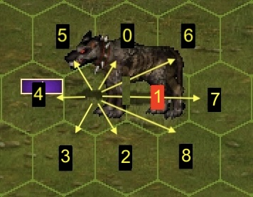

# Environment documentation

> [!WARNING]
> This project is still in active development and its documentation may be
> outdated. It reflects the project's state as of March 2024, but frequent
> code changes make it hard to maintain an up-to-date documentation at
> this stage.

## API

`vcmi-gym` implements the Gym API, please refer to the
[Gymnasium](https://gymnasium.farama.org/) documentation for reference.

## Observation space

vcmi-gym uses a
[`Box`](https://gymnasium.farama.org/api/spaces/fundamental/#box)
observation space with shape `(1, 11, 840)`. The "channel" dimension (`1`) is
added for the purposes of framestacking or other future uses, but for now it's
not really used and can be ignored. This leaves a `(11, 840)` space which
is better thought of as `(11, 15 * 56)`, corresponding to the battlefield's
11x15 hex grid (165 hexes total), with 56 attributes for each hex.

<p align="center"></p>

The 56 hex attirbutes are normalized into the `[0,1]` range via a linear
transformation. A normalized value of `0` typically corresponds to the
unnormalized value `-1` which is used to indicate a N/A or NULL value
(e.g. for "Stack Quantity" this means "no stack on this hex"). A normalized
value of `1` corresponds to whatever maximum is defined for that attribute
(eg. 5000 for "Stack Quantity"). All unnormalized values are integers.

| Attribute index | Description | Value range (unnormalized) |
| - | - | - |
| 0 | Hex Y coordinate | 0..14 |
| 1 | Hex X coordinate | 0..10 |
| 2 | Hex state \* | 1..4 |
| 3 | Stack Quantity | -1..5000 |
| 4 | Stack Attack | -1..100 |
| 5 | Stack Defense | -1..100 |
| 6 | Stack Shots | -1..32 |
| 7 | Stack DmgMin | -1..100 |
| 8 | Stack DmgMax | -1..100 |
| 9 | Stack HP | -1..1500 |
| 10 | Stack HPLeft | -1..1500 |
| 11 | Stack Speed | -1..30 |
| 12 | Stack Waited (0=no, 1=yes) | -1..1 |
| 13 | Stack QueuePos | -1..14 |
| 14 | Stack RetaliationsLeft | -1..3 |
| 15 | Stack Side (0=attacker, 1=defender) | -1..1 |
| 16 | Stack Slot | -1..6 |
| 17 | Stack CreatureType | -1..150 |
| 18 | Stack AIValue | -1..40000 |
| 19 | Stack IsActive | -1..1 |
| 20 | Ranged dmg modifier for this hex (0.5=½, 1=¼) | -1..1 |
| 21..27 | Is hex reachable by friendly stack #1..#7? | -1..1 |
| 28..34 | Is hex reachable by enemy stack #1..#7? | -1..1 |
| 35..41 | Is hex next to friendly stack #1..#7? | -1..1 |
| 42..48 | Is hex next to enemy stack #1..#7? | -1..1 |
| 49..55 | Is hex attackable by enemy stack #1..#7? \*\* | -1..1 |

\* The hex states are: obstacle / occupied /  free(unreachable) / free(reachable)

\*\* _hex attackable by enemy stack X_ means that the enemy stack X can reach a
_neighbouring_ hex and melee attack from there.

Obtaining the attributes for a specific Hex is easier if the observation is
reshaped into an array of shape `(11, 15, 56)`:

```
import vcmi_gym
env = vcmi_gym.VcmiEnv("gym/generated/B001.vmap")
observation, _info = env.reset()

# 1. Reshape observation from (1, 11, 840) to (11, 15, 56)
# 2. Get attributes of hex #121 (X=1, Y=8)
# 3. Unnormalize the "Stack Quantity" from 0..1 to -1..5000
#    using the formula: vnorm * (vmax - vmin) + vmin

obs = observation.reshape(11, 15, 56)
hex121 = obs[8][1]
print("Quantity of the stack at hex #121: %d" % int(hex31[3] * 5001 - 1))
```
## Action space

vcmi-gym uses a
[`Discrete`](https://gymnasium.farama.org/api/spaces/fundamental/#discrete)
action space with a total of 2311 actions which is better thought of
`1` non-hex action + `2310` hex actions.

The non-hex action is `WAIT` and has value `0`. The remaining values are
used for one of the 14 actions for each hex (total for 165 hexes:
`165 * 14 = 2310`)

For a given Hex ID (0..164), the action value is: `hex_id * 14 + (1 + action_index)`:

|Action index|Description|
|------|-----------|
|0|Move to hex|
|2..13|Move to hex and attack at direction 0..11\*|
|14|Shoot at hex|

e.g. Moving to hex with ID=2 (X=2, Y=0) is described by the action `29`.

\* The 12 attack directions are as follows: 0..5 are the hexes that surround
the current unit, while 7..11 are special cases for 2-hex units (3 per side):

<p align="center">



</p>

## Action masking

The env object also exposes the `action_masks()` method which is not part of
the Gym API, but is useful for certain Reinforcement Learning scenarios where
invalid actions are masked in order to improve learning performance.

The method returns an `np.array` with 2311 `bool` values, indicating the
validity of the corresponding action (`True` means the action is valid).


## Rendering

The gym env supports only one type of rendering: the ANSI render.

It is intended to be rendered in terminals with ANSI color code support,
unicode support and monospaced font:

```python
import vcmi_gym
env = vcmi_gym.VcmiEnv("gym/generated/B001.vmap")
env.reset()
print(env.render())
```


> [!TIP]
> If your output looks unaligned, try changing the font of your terminal

> [!NOTE]
> Indexes in the rendered text are 1-based, e.g. a call to `.render()` after
> moving to X=2, Y=0 with `env.step(29)` will be logged as
> "Move to (3,1) \[30\]".
