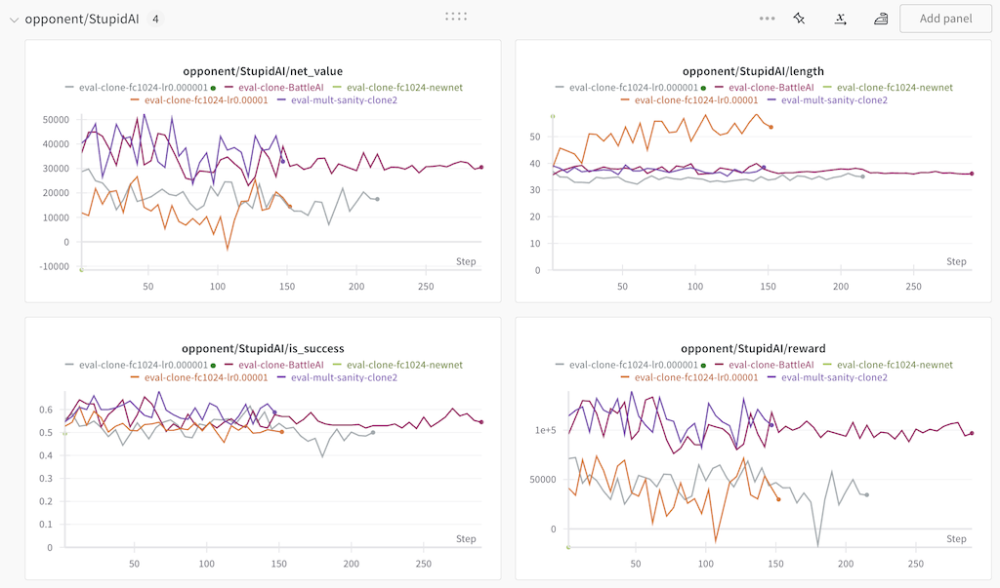
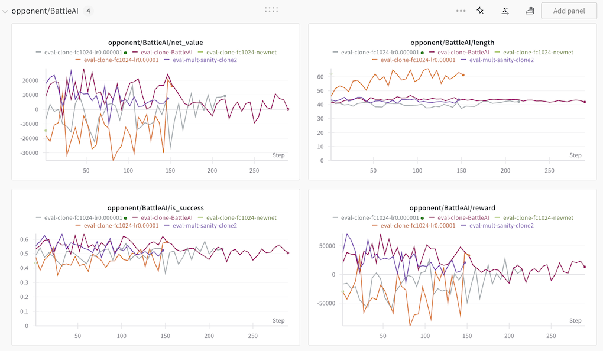

# RL Training

I've spent a considerable amount of time trying to design and train an AI model
in a resource-constrained setup (personal laptop) with moderate success - it
currently wins against the VCMI's Neutral AI (a.k.a. "StupidAI") and is kind of
50/50 against VCMI's "stronger" Player AI (a.k.a. "BattleAI").
It's by no means "challenging" for any decent human player, so there's much
to be desired :)

I've mostly been using PPO with action masking as the RL algorithm and am
experimenting with numerous neural network architectures. So far I have
achieved best results with a simple 1-layer 2D convolutional layer, followed
by a FC-1024 layer with batch normalization and LeakyReLU activations which is
basically showing a 60+% winrate vs VCMI's Neutral AI (StupidAI) and
is struggling at around 50% vs. VCMI's Player AI (BattleAI):

I've historically used PPO implementations from
[stable-baselines3](https://github.com/DLR-RM/stable-baselines3), but I find it
difficult to modify/customize, so I recently switched to a modified version of
[cleanrl](https://github.com/vwxyzjn/cleanrl).

I have also implemented a maskable variant of the QRDQN algorithm in hopes of
surpassing MPPO's performance, but the training results are not promising.
Other approaches such as self-attention layers, parameterized multi-head action
networks and LSTMs did not yield good results for me, but there's so much
tweaks that could be done there (which I do not have time for) that my efforts
are inconclusive.

I occasionally apply a
[Population-based training](https://deepmind.google/discover/blog/population-based-training-of-neural-networks/)
approach (using
[ray-project](https://github.com/ray-project/ray)'s PBT implementation)
provides nice results despite some implementation issues there (e.g. improper
worker cleanup). I also experimented with
[Population-based Bandits](https://www.anyscale.com/blog/population-based-bandits)
(a reportedly better alternative of PBT for small population sizes), but it did
not yield good results due to issues such as slow hyperparameter calculation
timesm, unproductive value "swings" (min->max->min->max..), etc. so I will
stick to PBT for now.

My W&B project with some of my recent training runs can be
found [here](https://wandb.ai/s-manolloff/vcmi-gym).

## Loading AI models into VCMI directly

Once an AI model is trained and ready for the "real" test (where YOU play
against it 🤓), you can plug it into VCMI directly in a game where it
controls the enemy army.

For this purpose, your model must implement a single `.predict(obs, mask)`
method where `obs` and `mask` are obtained from VcmiEnv (refer to
the [Environment docs](./env_info.md)). The model must be
[TorchScript](https://pytorch.org/docs/stable/jit_language_reference.html#language-reference).
Save the trained model to a file using `torch.jit.save(torch.jit.script(agent), "agent.pt")`
then start the (modified) VCMI binary as described in the "Loading AI Models" section
[here](https://github.com/smanolloff/vcmi/blob/mmai/docs/setup_macos.md#loading-ai-models)
