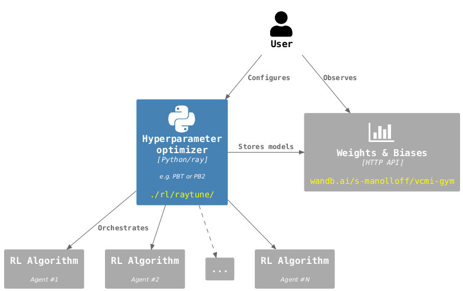

# RL Training

A fundamental part of the `vcmi-gym` project is the RL "toolkit" containing
algorithm implementations, neural network designs, hyperparameter tuning and
model evaluation tools.

## Overview

### RL Algorithms

Implementations of RL algorithms can be found in the `rl/algos` directory.

`vcmi-gym` contains implementations of PPO (Proximal Policy Optimization),
[PPG](https://arxiv.org/abs/2009.04416) (Phasic Policy Gradient),
[PPO-DNA](https://arxiv.org/abs/2206.10027) (PPO with Dual Network Architecture)
and [QRDQN](https://arxiv.org/pdf/1710.10044)
(Quantile Regression DQN).

The implementations are inspired by
[cleanrl](https://github.com/vwxyzjn/cleanrl) and
[Action Masking](https://arxiv.org/pdf/2006.14171) was added to all of
them, which significantly imroved the training performance, hence they are all
prefixed with an "M" for clarity (MPPO, MQRDQN, etc.). They are also wired to
push metrics to [W&B](https://wandb.ai/site) where their training performance
can be monitored.

Other RL algorithm implementations would make a fine addition to the project.
For example, opendilab's
[LightZero](https://github.com/opendilab/LightZero), which I was unable to
successfully integrate with vcmi-gym myself, but would still like to see here.
Contributions for this and any other RL algo implementations are most
welcome.

### Neural Network Architectures

There's a ton of different approaches here. I've had
[most success](https://wandb.ai/s-manolloff/vcmi-gym/groups/PBT-v3-mac-def-20240704_004131/workspace?nw=nwusersmanolloff)
with simpler NNs, usually containing a flat
[CNN](https://en.wikipedia.org/wiki/Convolutional_neural_network)
(Convolutional Neural Network) layer followed by an
[FCN](https://en.wikipedia.org/wiki/Feedforward_neural_network)
(Fully Connected Network) layer.

Agents trained with 
[Self-Attention](https://en.wikipedia.org/wiki/Attention_(machine_learning)),
[Residual](https://en.wikipedia.org/wiki/Residual_neural_network) and
[Recurrent](https://en.wikipedia.org/wiki/Recurrent_neural_network) 
(specifically [LSTM](https://en.wikipedia.org/wiki/Long_short-term_memory))
networks achieved an overall worse performance than the simpler NNs described
above. This
[W&B report](https://wandb.ai/s-manolloff/vcmi-gym/reports/Network-architectures--Vmlldzo3OTQ1OTkw)
offers a brief overview on the topic, although a bit outdated (LSTM is not even
included there), but the general idea still stands.

[Transformer](https://en.wikipedia.org/wiki/Transformer_(deep_learning_architecture))
networks are not really applicable in the RL domain, especially here, where
temporal dependencies seem less critical due to the (almost) 
[Markovian](https://en.wikipedia.org/wiki/Markov_chain) nature of the
observations during training (due to features like turn order and scripted
enemy action logic, for example). Popular applications of RL like
[OpenAI Five](https://arxiv.org/abs/1912.06680) (League of Legends AI) and
DeepMind's [AlphaStar](https://www.nature.com/articles/s41586-019-1724-z)
(StarCraft II AI) do not seem to use the Transformer architecture as well,
although the environments there involve complex spatio-temporal features.

Finding the best NN architecture for `vcmi-gym` remains an open topic (and an
active work-in-progress). The choice often involves hard-coding some of the
NN-specific features as part of the RL algorithm file -- there is no easy way
to make a "one size fits all" algorithm implementation without introducing too
much code complexity. For example, `rl/algos/mppo_lstm` uses the same
algorithm (MPPO) as `rl/algos/mppo`, but the two are independent of each other
for the sake of keeping them self-contained and easier to work with (at the
cost of some code duplication).

### Hyperparameter optimization

[PBT](https://deepmind.google/discover/blog/population-based-training-of-neural-networks/)
(Population Based Training) is by far my favorite method for training AI agents.
It seems to be most effective in training while managing the available system
resources. Here, the implementation from
[ray](https://docs.ray.io/en/latest/tune/api/doc/ray.tune.schedulers.PopulationBasedTraining.html)
is used. Although this implementation has its limitations, there are suitable
workarounds to overcome them (see code comments in `rl/raytune/pbt_config.py`
for more details).

A reportedly better version of PBT is ray's
[PB2](https://www.anyscale.com/blog/population-based-bandits)
(Population Based Bandits),
especially for small population sizes, but it was quite slow in practice
and seemed to only "explore" hyperparameter values at the boundary regions, so
I stopped using it. The PB2 entrypoint for vcmi-gym can still be found in
`rl/raytune/pb2.py`, but it hasn't been used in a while and might require some
code changes.

[W&B Sweeps](https://docs.wandb.ai/guides/sweeps) are another, comparatively
less efficient method for hyperparam optimization and I am no longer using
them, but the `rl/wandb/sweep-agent.py` is still available for use as a sweep
entrypoint if needed.

### Model evaluation

Although various metrics like win rate and mean episodic reward are recorded
during training, assessing the agent's performance in an environment other than
the one it is trained on is cruicial.

In vcmi-gym, model evaluation is done via the `rl/evaluation/evaluate.py`
script which loads a pre-trained model in inference mode and collects
performance results from several different environments on which the agent is
playing.

Once an AI model is trained and evaluated in such a way, it is ready for the
"real" test (where _you_ play against it 🤓) -- this involves running
the VCMI binary as a standalone program and manually playing a game where the
enemy troops are controlled by the AI model.

### Map generation

Maps used for AI training must conform to the following requirements:

* _a lot_ of different hero armies. This is needed when swapping heroes
  between battles to ensure agents train with a rich variety of army
  compositions. Currently, maps with 4096 heroes are used, which means there
  are more than 8M possible pairings and agents will rarely, if at all, see
  the same combination of armies more than once.
* _balanced_ hero armies. This is needed to ensure all battles involve equally
  strong armies which allows to set a performance baseline across episodes.

Manually creating such a map is out of question. `vcmi-gym` includes scripts
which automate the following processes:

1. _Creating_ a map.
  A map is created with a configurable average army strength based on the
  creature's [AI Value](https://heroes.thelazy.net/index.php/AI_value).
1. _Evaluating_ the map.
  The AI value used when generating the new map is only a rough indicator of
  the real army strength. Statistical information based on many conducted
  battles with each hero is gathered as a more reliable balance indicator.
1. _Rebalancing_ the map
  Hero armies are tweaked based on the collected stats, boosting weak armies
  and nerfing strong armies. Step 2. and 3. are repeated until the desired
  balance is achieved.

## Usage examples

### Using the RL algos directly


In its simplest form, training an agent involves running the file containing
the RL algorithm implementation as the main python module. Training RL models
like this is rarely done in practice, but can be useful for debugging purposes:

```bash
export NO_WANDB=true
python -m rl.algos.mppo.mppo
```

The `NO_WANDB` shell environment variable is optional and is used to disable
any HTTP communication with the W&B server (uploading metrics to W&B during
debugging is usually not desired).

During the training process, the below output can be observed:

```text
-- 2024-08-02 15:45:10 DEBUG [mppo-test/mppo-test] rollout=1 vstep=512 rew=-54.00 net_value=-12.30 is_success=0.09 loss=373.25
-- 2024-08-02 15:45:12 DEBUG [mppo-test/mppo-test] rollout=2 vstep=768 rew=-50.70 net_value=-12.90 is_success=0.07 loss=302.41
-- 2024-08-02 15:45:14 DEBUG [mppo-test/mppo-test] rollout=3 vstep=1024 rew=-49.35 net_value=-13.50 is_success=0.05 loss=282.00
```

It will continue forever unless interrupted. Snapshots of the model will be
periodically saved in the `data/mppo-test/` directory on the local disk
(this behaviour is controlled by the `save_every` and `out_dir_template`
parameters). In the case of MPPO, there are more than 50 configuration
parameters, around 10 of which concern the PPO algorithm itself, the rest are
mainly used to control VCMI-specific settings, logging, metrics, model saving,
etc. Hopefully, a comprehensive list and description for each of them will be
included in this document soon.

### Optimizing hyperparameters



Typically, training an RL model involves some form of hyperparameter
optimization. The example below shows how to optimize hyperparameters using
Population Based Training:

```bash
python -m rl.raytune.main -a mppo -n "PBT-test-{datetime}"
```

This will start a local `ray` cluster which will then spawn multiple new worker
processes (controlled by the `population_size` parameter, found in
`rl/raytune/pbt_config.py`) and will periodically create checkpoints. The
`rl/raytune/pbt_config.py` contains PBT configuration parameters as well as
configuration for the RL algorithm itself. 

This is how (almost) all of the models in the
vcmi-gym [W&B project](https://wandb.ai/s-manolloff/vcmi-gym) are trained.

#### Evaluating a single model


The below example evaluates a single model and then exits:

```bash
export NO_WANDB=true
python -m rl.evaluation.evaluate -m path/to/trained/agent.pt
```

This will start a script which will let the given pre-trained model play on
three different maps vs. each of two opponents: the "StupidAI" bot
(also used during training) and the "BattleAI" (a slower, stronger bot version,
not used during training). The results are printed to the standard output
as they become available, for example:

```text
-- 2024-08-02 15:36:20 <562811> [0] INFO: Evaluating T0 (PBT-mac-def-notowns-nomorale-nosummons-20240801_114636/91479_00000)
T0    88-3stack-300K.vmap StupidAI reward=9      net_value=10195  is_success=0.49   length=29  (64.99s)
T0    88-3stack-300K.vmap BattleAI reward=-55    net_value=-20139 is_success=0.40   length=34  (208.94s)
T0    88-3stack-20K.vmap StupidAI reward=-4     net_value=2371   is_success=0.59   length=28  (61.84s)
T0    88-7stack-300K.vmap StupidAI reward=9      net_value=9114   is_success=0.47   length=64  (153.88s)
T0    88-7stack-300K.vmap BattleAI reward=-61    net_value=-23959 is_success=0.36   length=66  (912.25s)
```

Those results will also be pushed to W&B, unless the `NO_WANDB` env var is set
to `true`.

#### Continuously evaluating new models


An automated approach which automatically pulls newly uploaded models from W&B,
evaluates them and pushes back model annotations and metrics in a distributed
manner:

```bash
zsh rl/evaluation/watchdog.zsh <N> <i>
```

where `N` is the total number of evaluators, and `i` is the current
(zero-based) evaluator ordinal index. W&B is used as a centralised storage,
while the evaluators can be distributed across one or more physical machines.

#### Creating, evaluating and rebalancing maps


To create a new map:

```bash
python maps/mapgen/mapgen_4096.py
```

A VCMI map as per the script's global variables will be created.
The location, average army strength, stack numbers and other aspects of the map
are configured via the script's global variables.

A newly created map contains _roughly_ balanced hero armies, purely based on
the [AI Value](https://heroes.thelazy.net/index.php/AI_value) creature property.
The VCMI client (the standalone binary, not the gym env) allows to specify a
sqlite3 database to write statistical information. Assuming it's been compiled
in the `vcmi/rel` directory, this is quivalent to:

```bash
rel/bin/mlclient-headless \
  --loglevel-ai error --loglevel-global error --loglevel-stats info \
  --random-heroes 1 --random-obstacles 1 --swap-sides 0 \
  --red-ai StupidAI --blue-ai StupidAI \
  --stats-mode red \
  --stats-storage "path/to/stats.sqlite3" \
  --stats-timeout 60000 \
  --stats-persist-freq 0 \
  --max-battles 30000 \
  --map "path/to/yourmap.vmap"
```

The VCMI process will statistics for 30K battles, store them in the sqlite3
db and exit. Refer to the `vcmi` docs for more information on the provided
arguments.

The next step is to rebalance the map based on the gathered stats:

```bash
python maps/mapgen/rebalance.py <path/to/yourmap.vmap> <path/to/stats.sqlite3>
```

This will _nudge_ each hero's army depending on the recorded winrates and
save the new map. Then the process of evaluating and rebalancing may be
repeated, as the iterative rebalancing approach produces better results in the
end, although it may seem slower.

## Loading AI models into VCMI directly

Your model must implement the `.predict(obs, mask)` and `.get_value(obs)`
methods, where `obs` and `mask` are values obtained from VcmiEnv on each step.
(refer to the [Environment docs](./env_info.md)). The model must be serialized
as a [TorchScript](https://pytorch.org/docs/stable/jit_language_reference.html#language-reference)
module.

Save the trained model to a file using
`torch.jit.save(torch.jit.script(agent), "agent.pt")`
then start the VCMI binary with the corresponding command-line options for
loading a pre-trained model, as described in the "Loading AI Models" section
[here](https://github.com/smanolloff/vcmi/blob/mmai/docs/setup_macos.md#loading-ai-models).
